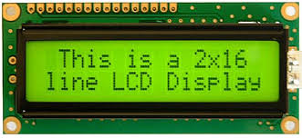

# Librería para el uso del LCD_2x16_con_XC8

> Uso del LCD externo tipo Hitachi HD44780 
> conectado a PIC 18 con el compilador XC8:

Adaptado por: Rommel Contreras - _rommeljose@gmail.com_

> Esta es una librería en lenguaje C (XC8), de uso general para la familia de
> microcontroladores PIC18xxx; pero debe funcionar para cualquier PIC. 
> Este módulo configura una pantalla LCD externa, basada en el controlador **LCD Hitachi HD44780** 
> o equivalente. El módulo configura los pines de E/S del microcontrolador, configura la pantalla
> LCD para los modos: 4 o de 8 bits, y proporciona un API para diferentes funciones o comandos del LCD 
>> **ver:** [Como_Usar_librería.pdf](https://github.com/rommeljose/LCD_2x16_con_XC8/blob/master/Generico_simple_LCD.X/Lib_mias_all/Guia_de_uso_libreria.pdf)

>> **Librería en:** [`.Lib_mias_all\microchip_LCD`](./Generico_simple_LCD.X/Lib_mias_all/microchip_LCD)

LCD 2x16 tipo Hitachi HD44780---> 
  
## La Librería admite las siguientes características:

•	Seleccionar la interfaz entre el módulo LCD y el microcontrolador, es decir, si se debe seleccionar Interfaz de 8 o 4 bits.

•	Selección de nibble superior o inferior en caso de interfaz de 4 bits.

•	Selección de puerto para transferencia de datos.

•	Selección de puerto y pin para las señales de control.

•	Facilidad para conectar a tierra el pin R/W de la pantalla LCD (si no se requiere lectura), lo que puede ayudar a salvar un puerto pin para el microcontrolador.

•	Selección del modo, ya sea que el usuario quiera retrasar o leer el indicador de ocupado entre comandos.

•	Selección de funciones de Bloqueo o No Bloqueo.

•	Configurar los parámetros como una o dos líneas, selección de fuente, cursor encendido, parpadeo, etc.

## Funciones externas del LCD:

`BusyXLCD`	¿Está ocupado el controlador LCD?

`OpenXLCD`	*Configura las líneas de E/S utilizadas para controlar la pantalla LCD e inicialice la pantalla LCD.*

`putcXLCD`	Escribe un byte en el controlador LCD.

`putsXLCD`	Escribe una cadena de datos en la memoria de la pantalla LCD.

`putrsXLCD`	Escribe una cadena de programa en la memoria de la pantalla LCD.

`ReadAddrXLCD`	Lee el byte de dirección del controlador LCD.

`ReadDataXLCD`	Lee un byte del controlador LCD.

`SetCGRamAddr`	Establece la dirección del generador de caracteres.

`SetDDRamAddr`	Establece la dirección de datos de visualización.

`WriteCmdXLCD`	Escribe un comando en el controlador LCD.

`WriteDataXLCD`	Escribe un byte en el controlador LCD.

> Las versiones pre compiladas de estas funciones utilizan asignaciones de pines predeterminadas
> que se pueden cambiar redefiniendo las siguientes asignaciones de macros en el archivo xlcd.h, 
> que se encuentra en el subdirectorio: `.\Generico_simple_LCD.X\Lib_mias_all\microchip_LCD`. 
> El archivo de encabezado `xlcd.h`, hay que incluirlo en el proyecto.

***
### Ejemplo de uso

```
#include "./mcc_generated_files/mcc.h"
#include "./Lib_mias_all/microchip_LCD/xlcd.h"
#include "./Lib_mias_all/micelaneos.h"

/*            Programa Principal   */

void main(void)
{
    // Initialize the device
    SYSTEM_Initialize();
   
    LCD_inicio();

 while (1)
    {
        // Add your application code

    while (BusyXLCD()); // Esperar, si el LCD esta ocupado  
    SetDDRamAddr(0x80); // Principio area visible LCD
    
    while( BusyXLCD() ); 
    putrsXLCD("   CARIPITO ");
    __delay_ms(2000);

    while (BusyXLCD());
    SetDDRamAddr(0xC0); // Principio area visible LCD
    
    while( BusyXLCD() ); 
    putrsXLCD(" MONAGAS, Venz. ");
    __delay_ms(2000);
    
    while (BusyXLCD()); // Esperar, si el LCD esta ocupado 
    WriteCmdXLCD(0x01); // Limpia la pantalla del LCD

    }
}
/**
 End of File
*/

```
***

### Referencias:

> [MPLAB® C18 C COMPILER LIBRARIES (DS51297F)](https://ww1.microchip.com/downloads/en/devicedoc/mplab_c18_libraries_51297f.pdf)
>> El propósito de este documento es proporcionar información detallada sobre las bibliotecas y los archivos 
>> de objetos precompilados que se pueden utilizar con **MPLAB de Microchip® C18 C Compiler**.

> [MPLAB® IDE Quick Start Guide (DS51281)](https://ww1.microchip.com/downloads/en/devicedoc/51281e.pdf)
>> Describe cómo configurar el software IDE de MPLAB y usarlo para crear proyectos y dispositivos de programa.
